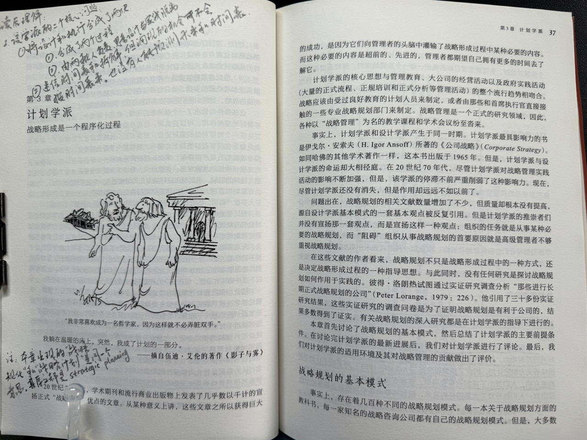
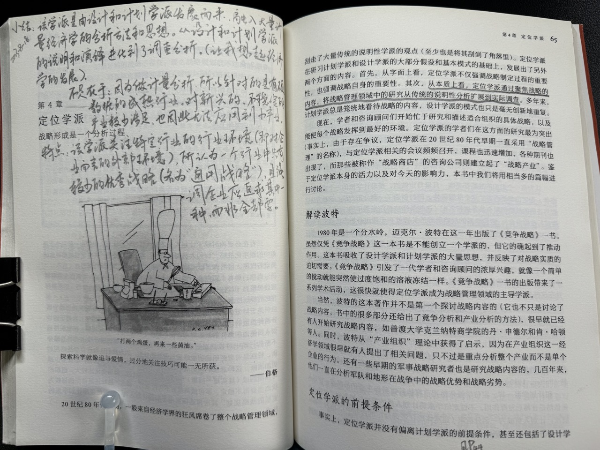
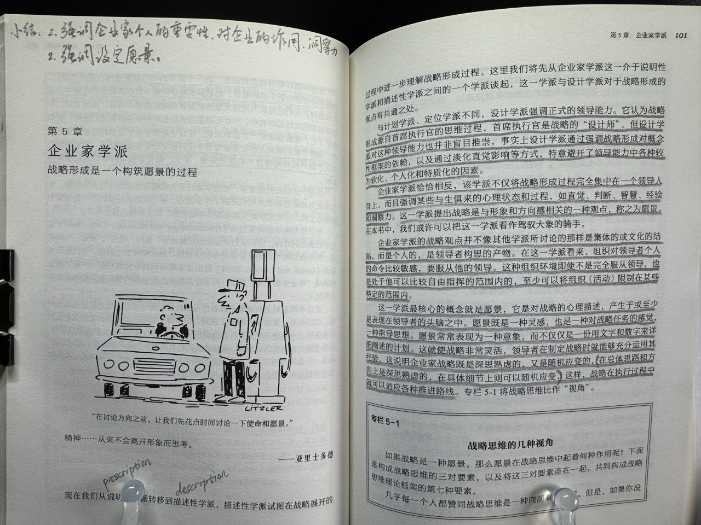
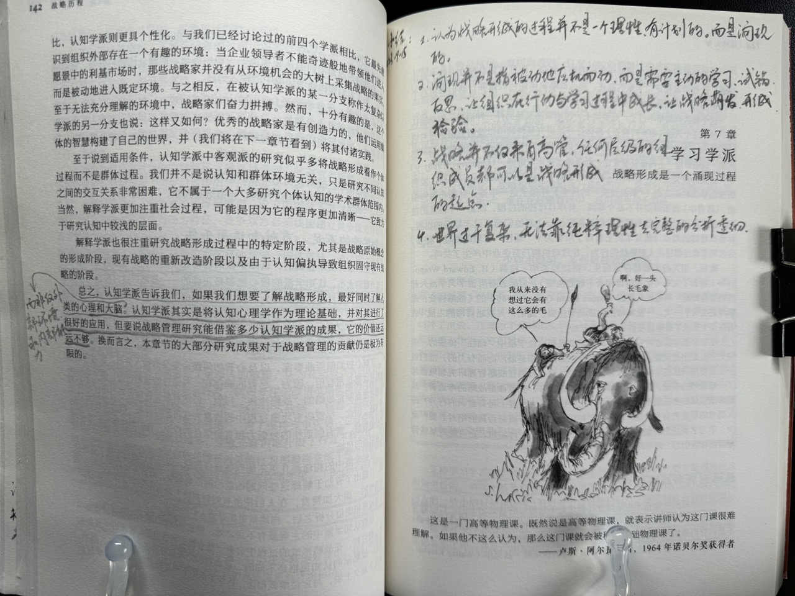
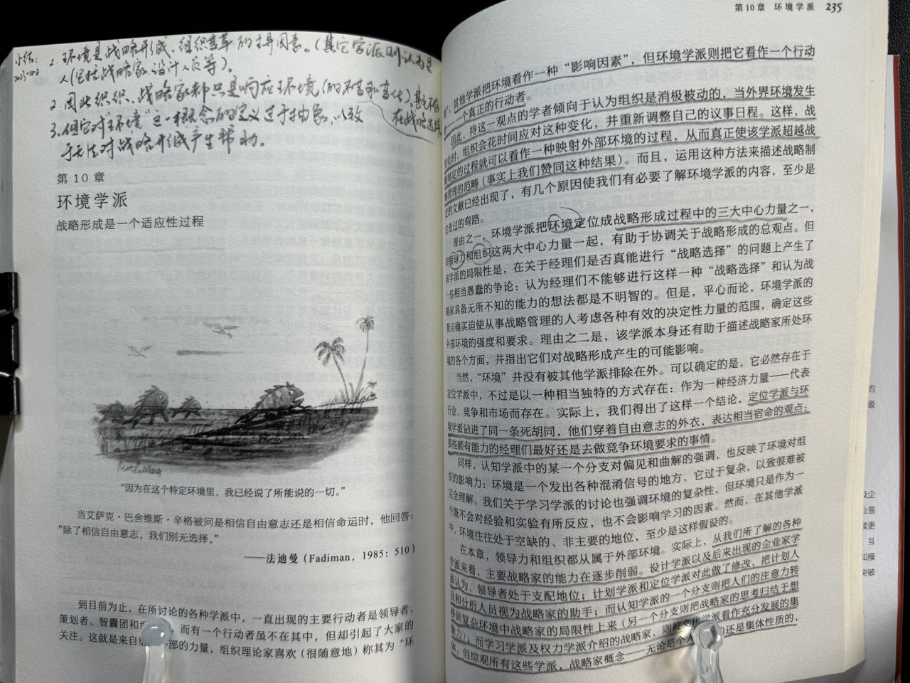





## 第 3 章：设计学派

该学派的两个核心问题：
1. 将设计和执行分成了两块：
    1. 分成了两个过程。
    2. 由两批人负责，导致思考设计和实践脱离。
2. 迷信时间计划表和拆解，但涌现的机会可不会按时间表出现。也没有人能预测未来和时间表。

## 第 4 章：定位学派

该学派是由设计和计划学派发展而来。融入大量计量经济学的分析方法和思想。从设计和计划学派的说明和演绎进化到了调查分析。让我想起了经济学的发展。

不足在于：因为做计量分析，所以针对的是有硬数据的成熟行业。对新兴的、不稳定的产业较少涉足，也因此无法应用到小产业。

特点：该学派关注特定行业的行业环境（即对企业而言的外部环境），认为一个行业中只有较少的优秀战略（名为“通用战略”），且强调企业应追求其中一种，而非全都要。

# 第 5 章：企业家学派

1. 强调企业家个人的重要性、对企业的作用、洞察力。
2. 强调设定愿景。

# 第 6 章：认知学派

战略家的认知（信念、价值观、学识、偏见等）对战略的形成起决定性作用。相较而言，外部环境是次要的，甚至被该学派的解释派认为是不存在的、主观的。

## 第 7 章：学习学派

该学派认为战略形成的过程并不是一个理性的、有计划的，而是涌现的。

涌现并不是指被动地应机而动，而是需要主动地学习、试错、反思。让组织在行动与学习过程中成长，让战略萌发、形成、被检验。

战略并不仅来自高管，任何层级的组织成员都可以是战略形成的起点。

世界过于复杂，无法靠纯粹理性去完整、透彻地分析。

## 第 8 章：权力学派

在组织内部，会有不同的利益团体。战略的形成过程充满了权力争夺、政治协商。因此战略必然是涌现的。甚至，战略和政治谁是目的、谁是手段都不一定。

在组织外部，权力和政治依然不可避免。因为组织要处理供应商、投资者、政府、同行的诉求，并争取自己的利益。

## 第 9 章：文化学派

文化是组织成员的共识、共同观念和行为模式。它难以用语言完全描述，却是战略形成的基础，并深刻地影响战略的形成和执行。

文化是稳态的，难以快速转变的，因此会在一定程度上阻碍变革。

资源观将组织看作资源的组合，包括物质资源、人力资源、组织资源，并解释了将资源转化为持续竞争优势的条件。

## 第 10 章：环境学派

该学派的主要观点是：

环境是战略形成、组织变革的主导因素。其他学派则认为是人（包括战略家和设计人员等）。

因此组织、战略家都只是响应环境(的不变和变化），甚至不存在战略选择。

但该学派对“环境”这一概念的定义过于抽象，以至于无法对战略产生帮助。

## 第 11 章：配置学派

这个学派是十个学派里我最迷糊的，读完处于懵的状态，读的过程中也是。脑子里的主要困惑是“这个学派的核心观点是啥？”。因为没读懂，因此以下小结借了 ChatGPT 的力量。

该学派强调组织是由起各种特质相互协同的整体。组织的效能取决于这些特质的相互补齐和相互强化程度。这些特质的组合方法、形成综称为配置（Configuration，本书译作结构，我觉得有点勉强）。

不同的或同一个组织在不同的环境、时期的配置可能不同。这个不同就是战略变革引发的、导致的。

认为组织的状态过程是由稳态和变革两类阶段组合而成，并形成一个模式。比如有的企业稳态占了绝大多数，只在少数几个外部环境巨变时才引入变革阶段。

强调稳态是战略管理的关键，而非其他学派关注更多的变革阶段。

后记：写完发现绝大多数是我自己的理解，而非 ChatGPT。看来我还是读懂了一些内容的，哈哈。

