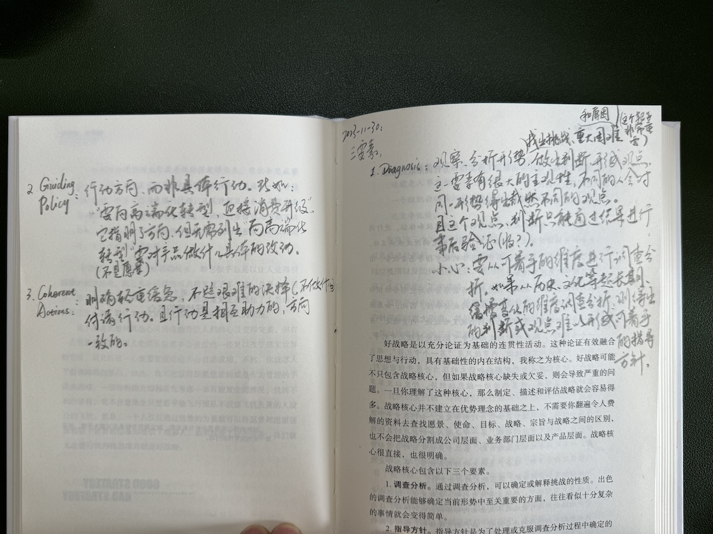
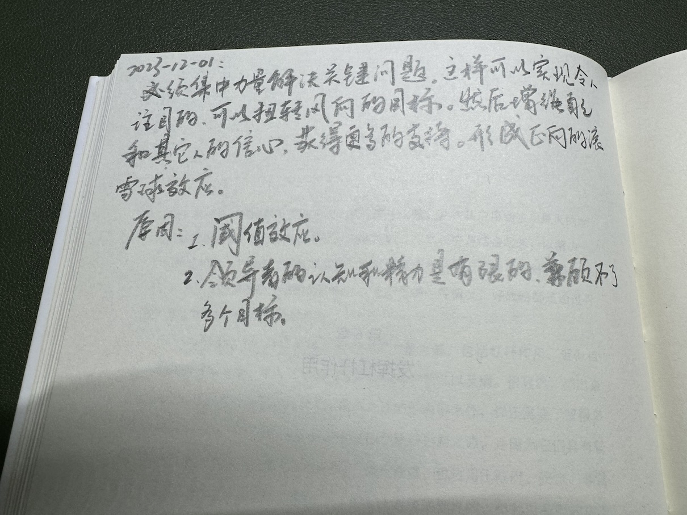
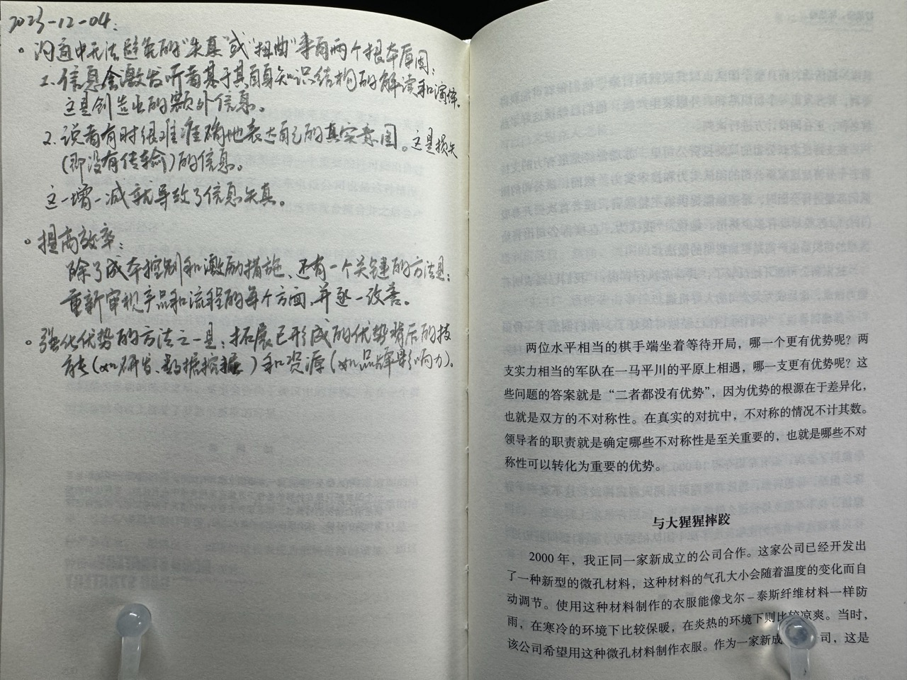
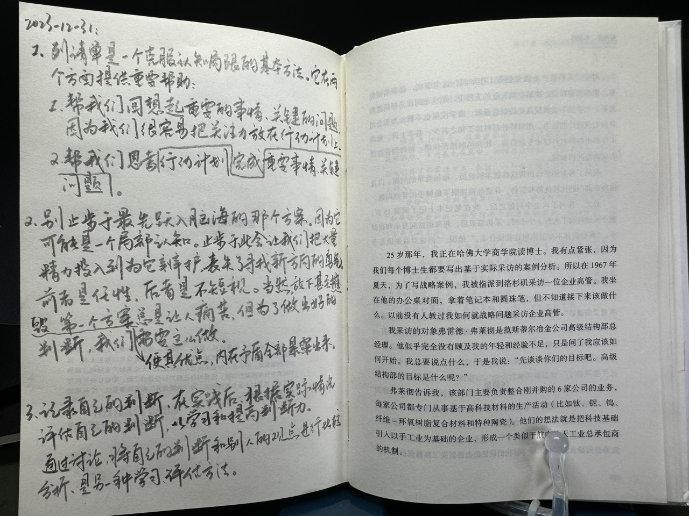





## 第 5 章：好战略的核心

好战略的三要素：
1. Diagnosis（调查分析）
2. Guiding Policy（指导方针）
3. Coherent Actions（一致行动）

### Diagnosis

观察和分析形势，找出挑战、重大困难和原因（这个靶子非常重要），做出判断、形成观点。

这一要素有很大的主观性，不同的人会对同一形势得出截然不同的观点。且这个观点、判断只能通过结果进行事后验证。

需要小心的是：要从可着手的维度进行调查分析。如果是从历史或文化等超长期、缓慢变化的维度调查分析，则得出的判断或观点难以形成可着手的指导方针。

### Guiding Policy

行动方向、而非具体行动。比如：“向高端化转型、迎接消费升级”。它指明了方向，但无需列出“向高端化转型”需要对产品做什么具体的行动。

但它并不是愿景。

### Coherent Actions

明确轻重缓急，不避艰难的抉择（比如：不做什么），付诸行动。且行动是相互助力的，方向一致的。

## 第 6 章：发挥杠杆作用

必须集中力量解决关键问题。这样可以实现令人瞩目的、可以扭转风向的目标。然后增强自己和其他人的信心，获得更多的支持。形成正向的滚雪球效应。原因是：
1. 阈值效应。
2. 领导者的认知和精力是有限的，兼顾不了多个目标。

## 第 7 章：制定近似目标

领导者的职责是：降低决策环境的模糊性，简化问题形成一个切实可实现的目标，也就是奋斗目标的近似目标。

这一章的主张让我想到了 Scenario Planning —— 将纷繁复杂的现状和趋势化为少数几个 scenario，然后设计指导方针（应对大策）。

## 第 8 章：强化环环相扣的系统

相互衔接的行动不仅让自身相互促进，还让竞争对手难以模仿。

## 第 9 章：运用设计思维

略

## 第 10 章：寻找焦点战略

如果企业取得了成功，那么就应分析出成功背后的深层战略逻辑，然后集中资源使用这个战略逻辑实现一个目标。这就是正确的聚焦。

注：深层战略逻辑很可能是企业与同行相比与众不同的。所以多想想“为什么是这家公司？”。分析师、财经新闻对它的解析很可能是浅层的。

## 第 11 章：保证有效的增长

健康的增长表现为市场份额增加且有很好的利润率。它来自于市场需求的增加和企业产品出色地满足市场需求，而不是可以地策划设计。

## 第 12 章：发挥竞争优势

沟通中无法避免的“失真”或“扭曲”来自两个根本原因：
1. 信息会激发听者基于其自身知识结构的解读和演绎。这是创造出的额外信息。
2. 说者有时很难准确地表达自己的真实意图。这是损失的（即没有传输的、会传输错误的）信息。

提高效率除了成本控制和激励措施，还有一个关键的方法是：重新审视产品和流程的每个方面，并逐一改进。这让我想到了《看板方法》。

强化优势的方法之一是：拓展已形成的优势背后的技能（如研发、数据挖掘）和资源（如品牌影响力）。

## 第 13 章：秉持动态的视角

为了识别变革，必须识别出基础力量。这需要掌握足够多的专业知识，才能不迷信权威。

不需要制定完全正确的战略，只要比竞争对手多分析出一些东西，比他们的战略更正确就行了，就能获得竞争优势。但因为不知道他们的战略有多正确，因此我们仍需全力以赴。

变革会有一些风向、经验之谈、思考方法。比如：
1. 固定成本上涨。比如乘用车市场的智能驾驶带来的研发成本。
2. 政府管制放松。
3. 可预见的倾向。如耐用品市场里，增长越快，饱和越早。
4. 吸引者状态。即行业演化趋势、目标。比如乘用车市场的 EV 化。

## 第 14 章：利用惯性

企业面临的最大挑战可能是自身的惯性和熵。这种情况下，重点工作就是做变革。

企业做变革时应识别出两种力量：
1. 惯性：
    1. 工作流惯性：比如依赖长期以来的经验、方法、工具、节奏等。
    2. 企业文化惯性：应对之法是精简，消除多余的工作流程、不必要的管理和业务流程。
    3. 代理惯性：由于客户依赖某个业务产生的惯性。即客户依赖带来了有利可图、可继续维持的业务。企业因此持续投入到该业务。
2. 熵：由于企业管理不力（日积月累）而形成的失序、内部交叉补贴、制度和经营方针的模糊和落后。

## 第 15 章：综合运用多种有利因素

1. 战略是理性的、主观的的判断和假设（见本章中“英伟达公司的战略”一节中大量“预料”、“判断”、“估计”、“相信”）和验证之法。以及第 16 章提出的“好战略是一种可行性的假设”观点。
2. 分出主要和次要。比如英伟达的先在性能上占据优势，再解决研发过程中出现的延迟、成本等问题。

## 第 16 章：战略的科学含义

好战略是一个关于可行性的假设。它基于业务知识、洞察和基础原理（比如商业的、社会心理的），也要经过它们的检查（逻辑性的沙盘推演）。然后进行实践、观察，根据实际情况验证假设。

因此可以说，形成好战略的过程是一个科学实证过程。仅靠推演分析就得出战略是一种不切实际的幻想。

## 第 17 章：塑造战略思维和判断能力

列清单是一个克服认知局限的基本方法。它在两个方面提供重要帮助：
1. 帮我们回想起重要的事情、关键的问题，因为我们很容易把注意力放在行动计划上。
2. 帮我们思考完成重要事情、关键问题的行动计划。

别止步于最先跃入脑海的那个方案。因为它可能是一个局部认知。止步于此会让我们把大量精力投入到为它辩护，丧失了寻找新方向的勇气。前者是任性，后者是不短视。当然，放下甚至摧毁第一个方案，使其优点和内在矛盾全部暴露出来总是让人痛苦。但为了做出好的判断，我们需要这么做。

记录自己的判断，在实践后，根据实际情况评估自己的判断，以学习和提高判断力。通过讨论，将自己的判断和别人的观点进行比较分析，是另一种学习和评估方法。

## 第 18 章：保持冷静的头脑

从众心理：当我们对某个事无不了解时，会假设肯定有人比我们知道的多，导致盲目地模仿别人的行为。部分马太效应由此而来，见王慧文的产品课。

内在视角：认为“这次情况不一样”，即认为自己所面临的是特殊的、与众不同的。

抵制上述两种倾向的方法是：
1. 关注与众人附和论调相反的现实数据。
2. 吸取他人、他地的经验教训。

难啊

