
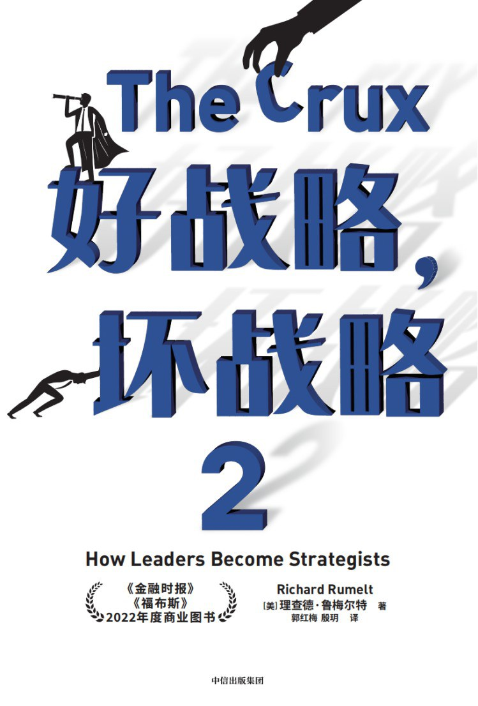


## 第 1 章：卡洛琳的难题 —— 如何制定战略

基于面临的挑战而非目标来制定战略：
1. 脱离现有挑战和情况分析的目标是模糊的空话。
2. 在动态变化的商业市场里，基于现实挑战和探索而形成的战略有更好的适应性和灵活性。
3. 商业市场里，行动和结果之间并不存在很强的因果，因此单纯的追求目标并不能生成（倒推出）有效战略。根据实际情况（比如对手弱点）和挑战更容易制定有效战略。
4. 深度的分析（实际情况、挑战、机遇等）能帮助发现和制定更本质的战略，因为能找出理论依据，也更容易让员工明白战略和下一步该怎么走。

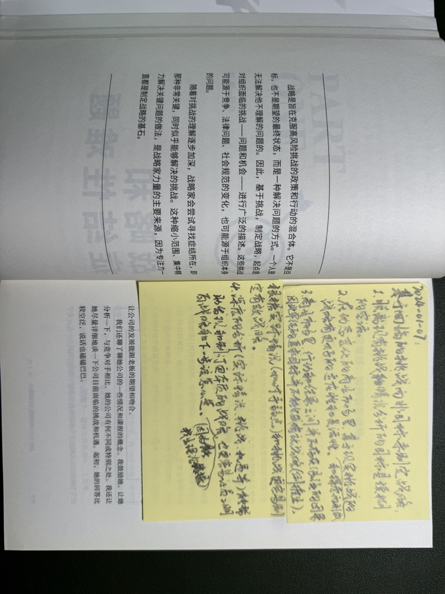

## 第 2 章：应对挑战 —— 发现并利用症结型难题

战略不是推理，而是设计：
* 前者指从定理推导出结论。适合从前提到结论有明确的定义和逻辑递进的情况。
* 后者是在复杂（Complex）和不确定的环境中，探索可能性和约束，了解系统行为后创造解决方案，然后根据实际结果做下一步的设计。

挑战之所以棘手在于，通常，
1. 问题不明确。
2. 解决方案不明确。
3. 潜在行动与实际结果之间的关系不明显。
4. 既要……又要……还不想……。

而我们之所以追随卓有成效的管理者是因为他们已经确定了什么是棘手的挑战，并制定了解决方案。

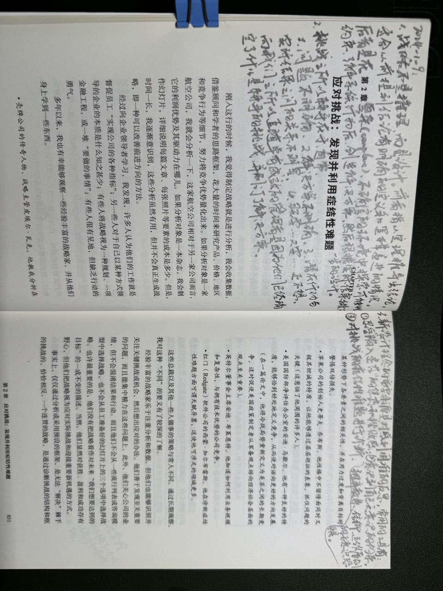

## 第 3 章：制定战略是一场旅行

制定战略是诊断和应对所面临的重大挑战，而非重申模糊的总体目标。

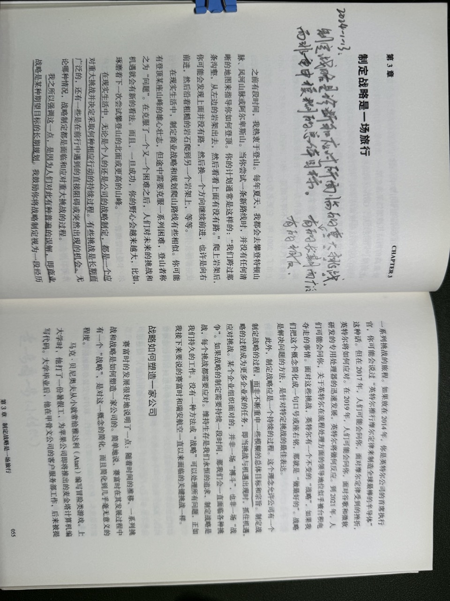

## 第 4 章：玩你能赢的游戏

通过诊断分析，我们会识别出很多挑战，为了集中精力，我们需要选择其中部分。一种方法是用“重要性”和“可解决性”两个维度进行筛选。在讨论每个挑战时，不同的人可能有不同的观点和评分。收集这个过程中因激烈讨论形成的有价值的见解。如果分歧无法解决，就通过层级制度来解决。

经常遇到的一个情况是有太多目标，导致无法形成可行的方案。因为每个目标都会带来约束，比如追求利润的目标可能约束了成本预算。甚至目标之间有根本性的冲突。此时，后退一步，重新评估，特别是长期影响，并努力识别出核心问题。

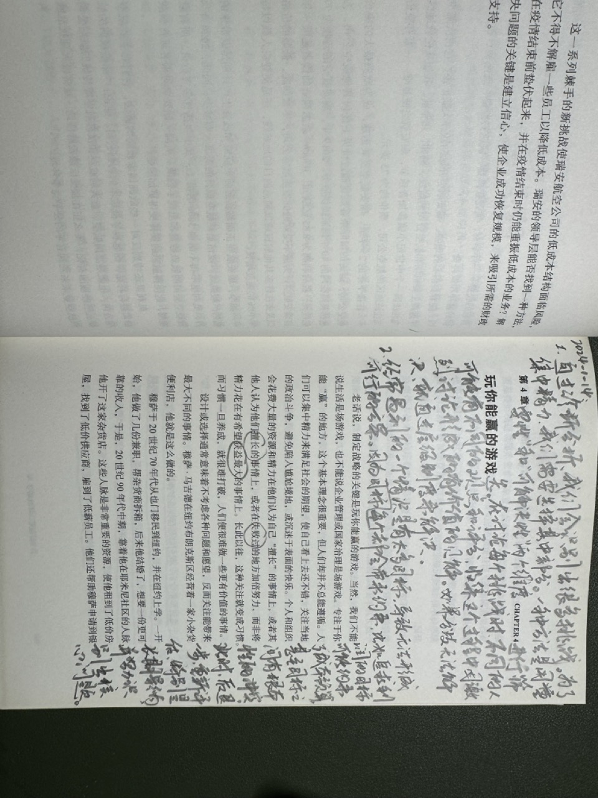

## 第 5 章：增长的挑战

略。

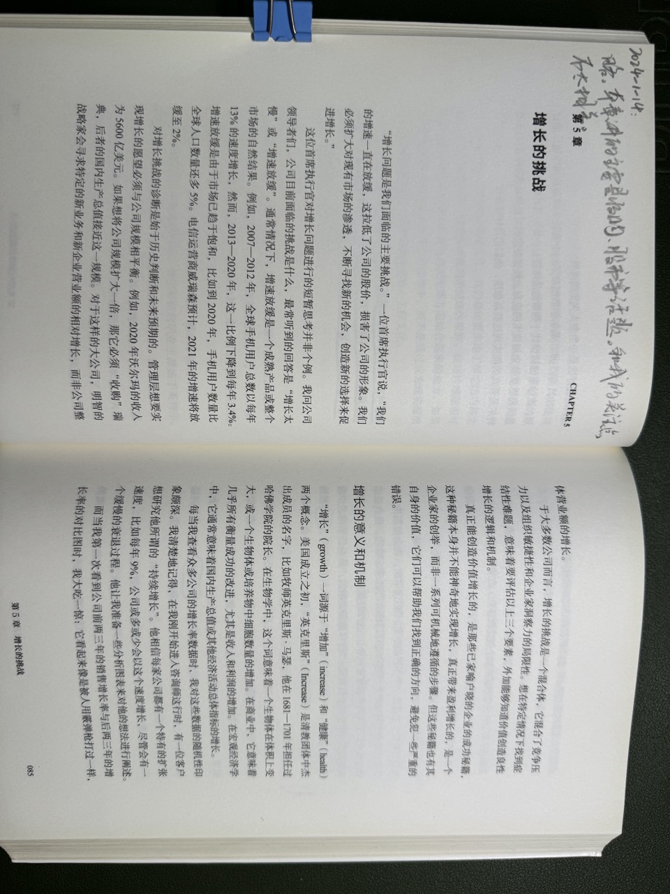

## 第 6 章：权力的挑战

战略一定是有意设计的，而非环境学派和进化论所认为的无需做什么就自然进化得到的。战略带来的重大变化往往伴随着权力和资源的转移。

实施战略需要行政权力。获得权力的方法是做出小成绩，以此获得信任和支持，然后滚雪球。

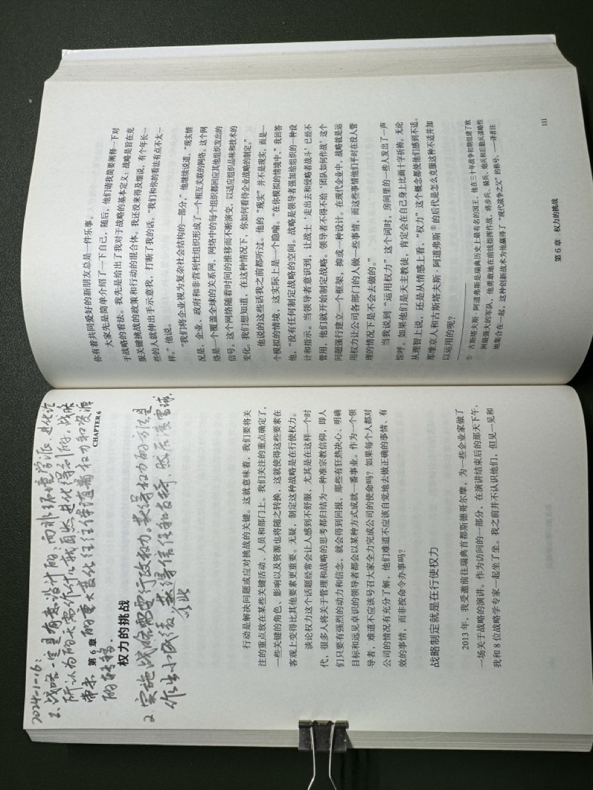

## 第 7 章：行动重在连贯

行动应与指导方针一致、不冲突。这听上去理所应当，但反例并不少见。一个普遍原因是为了满足太多欲望、达成太多目标而作出妥协。比如要科技领先，同时减少科研和教育支出。

获得一致性的代价是用合理的价值观和论据对许多利益说不。战略家尽量不要做政治家。折中以及照顾到所有人利益的艺术并非战略家的艺术。

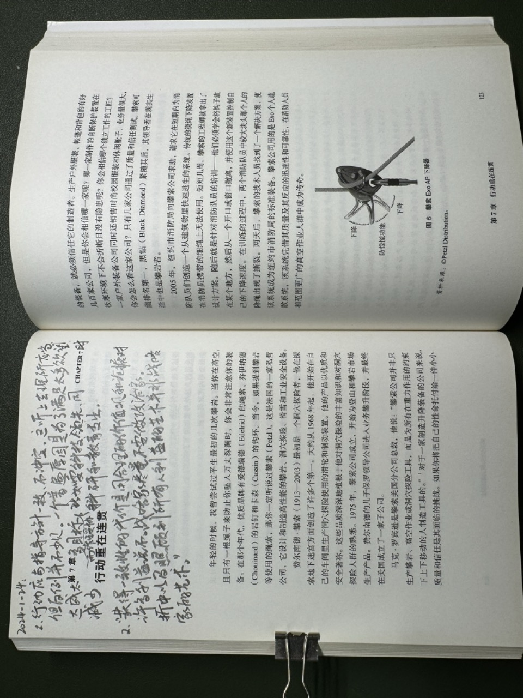

## 第 8 章：问题是什么 —— 通过重构和类比进行诊断

重构（Reframe），意为改变看待事物的视角。

诊断时，一个常见障碍是一些管理者认为领导力意味着强调积极的一面，并对消极的一面避而不谈。由此产生了偏见。

通常解决一个商业问题比解决结构和运转问题对公司的威胁要小得多。因为后者直接威胁权力和地位。而且，随着人们找到解决问题的方法后，组织结构的变化会随之而来。

## 第 9 章：通过比较和框架做出诊断

略。

## 第 10 章：“锋利”的分析工具要慎用

现实情况太复杂，因此人们创造了很多工具来简化。不同的工具的简化方法不同，各有自己独特的假设和侧重点。所以我们使用工具之前应知晓，轻视这一点会带来恶果。

有些“锋利”、“美丽”的工具被很少使用是因为重大战略的关键风险是执器人的能力不足或操守存疑。而工具无法覆盖这个风险。复杂工具反而可能让这个风险更难被发觉。

克里斯坦森在《创新者的窘境》里提出的“颠覆”未能得到后续研究的支持。但颠覆性挑战确实存在，其中最难应对的是赖以生存的生态被破坏，就如柯达公司面对的那样。

一个至今未能解决的问题是“代理（Agency）问题”。“代理”是指首席执行官和经理人等代股东董事会掌舵的人，他们的利益和股东董事不完全对齐，且通常具有信息不对称的优势。因此可能会做出符合自身利益、但有损股东利益的决策。

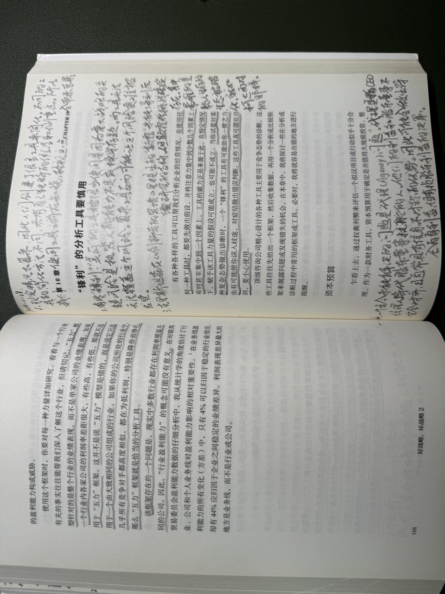

## 第 11 章：寻找获胜之记

别进行“伯川德（Bertrand）竞争“，即：
1. 产品是标准化的、无差异性的（如纯净水）。
2. 所有竞争者的产能都充足。
3. 价格变化很容易传达给用户。

这种竞争通常会陷入残酷的价格战。另外，别投资此类竞争的基础设施。

规模经济会带来高经营效率和市场控制。但规模这一因素并不一定会形成规模经济。也就是说，并不是规模大就更好，有一些反规模因素可能会抵消规模效应。比如不同文化的企业合并后反而表现更差。所以应考虑可能的多个因素。

规模效应主要是因为单位成本降低。但如果其关键要点是可轻易迁移的，那么规模效应带来的竞争优势是短期的，因为竞争对手很容易就学会并达到一样的单位成本和经营效率。

网络效应会提升产品的价值。要产生网络效应，产品的价值必须随着用户变多而上升。用户量和产品价值形成相互强化。

平台效应是对两类用户（如商家和买家）都有网络效应的，如果对双边都有粘性或”锁定“，则效应更强。

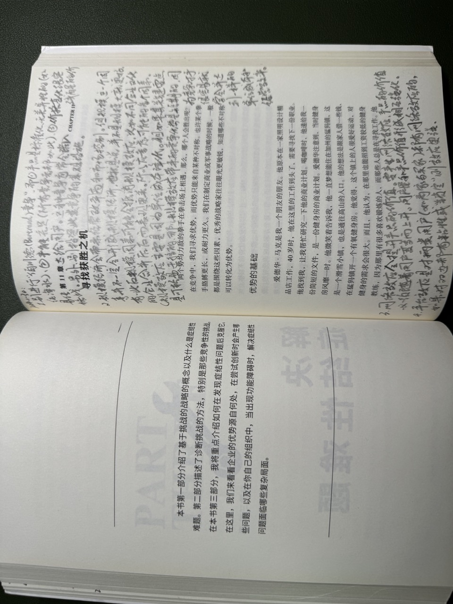

## 第 12 章：关注提供创新的机制

在很多情况下，创新能否成功取决于互补资本（Complementary assets）。即将创新推向市场与提供其所需的任何辅助服务所必须的技能或资源。

在面对巨头时，年轻公司应解决的关键问题是如何利用自己的敏捷性、更少的官僚作风在竞争中获胜。

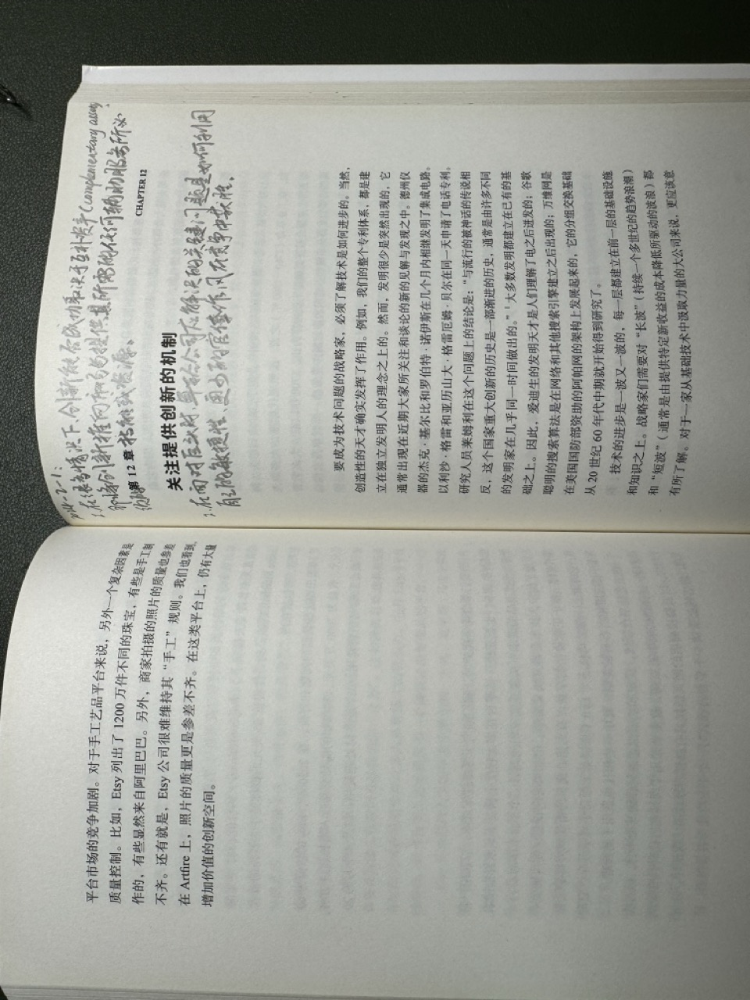

## 第 13 章：组织失能的挑战

企业成功的方法会被传习，也成为组织失能的开始。

如果需要创新，就需要奖励冒险和大胆的新举措。刚开始时，不妨千金买马骨。

警惕矩阵结构，它可能会分散管理者的职责，以至没有人为结果负责。

不管公司的规模多大，最高层的核心团队都是 5～8 人。他们带领和指导由 20～40 位经理组成的团队负责变革过程。如果没有这样一个团队，在思想上跟上核心管理层，并在日常工作中带头冲锋，那么企业很难变革。

改变文化之所以困难，是因为人们的信念和承诺。同时不能把自己的想法强加于人，只能把变革与企业战略、个人利益联系起来。

一种关于组织变革的观点：改变群体规范的唯一方法就是改变首领。在所有人类群体中，首领定义了思考和行动的“正确”方式。因此改变首领就改变了行为。这个首领是每个人都尊重和效仿的人，而不一定是正式负责的人。

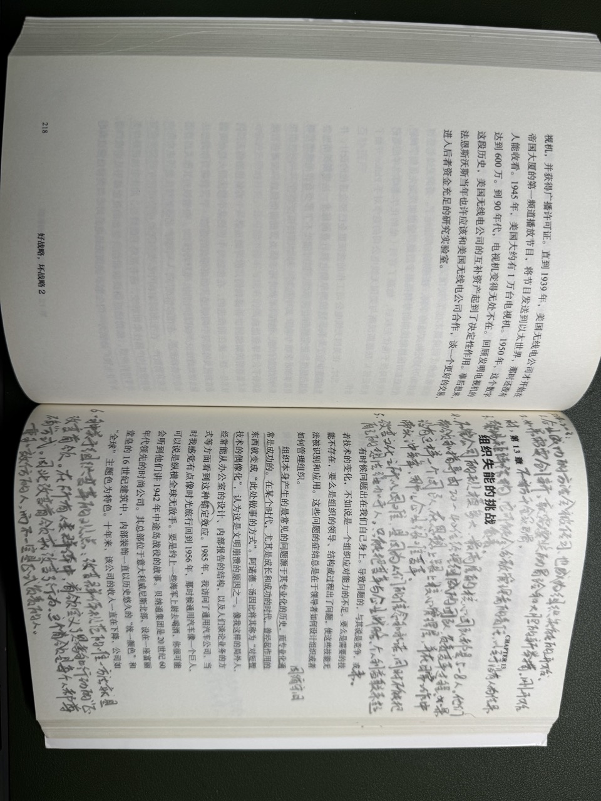

## 第 14 章： 不要从目标入手

目标（Goal）不是设计战略的起点。我们无法直接从目标倒推出战略。在缺乏对关键挑战的诊断的情况下，设定目标会带来两个问题：
1. 目标难以指导行动，目标本身也就缺少支撑。
2. 可能让组织把精力、资源集中到无效行动上，忽略了真正的挑战。

应从明确关键挑战、诊断症结开始思考战略。

明确了前进的道路之后，可以设定目标来指导行动和衡量行动的成效。这些目标通常能降低整体挑战的模糊性，帮助确定该做什么、不该做什么。

在缺乏诊断的情况下，设定财务型的战略目标的一种可能性是：董事会这样的核心决策者或团体缺乏对业务的了解，只能使用财务会计这仅有的共同语言。

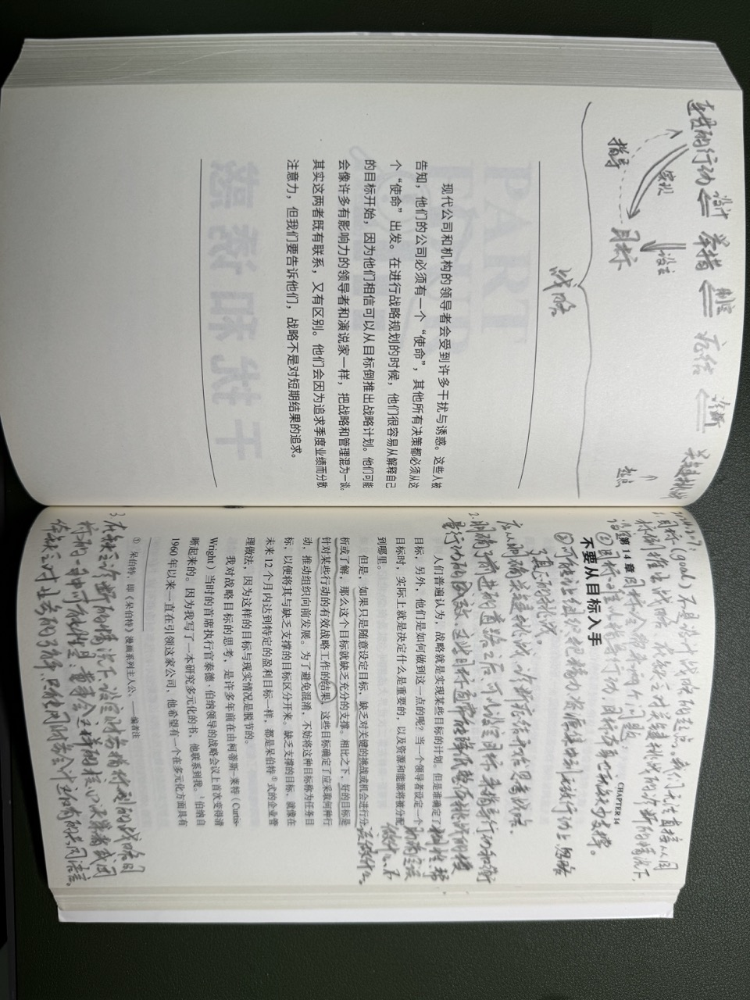
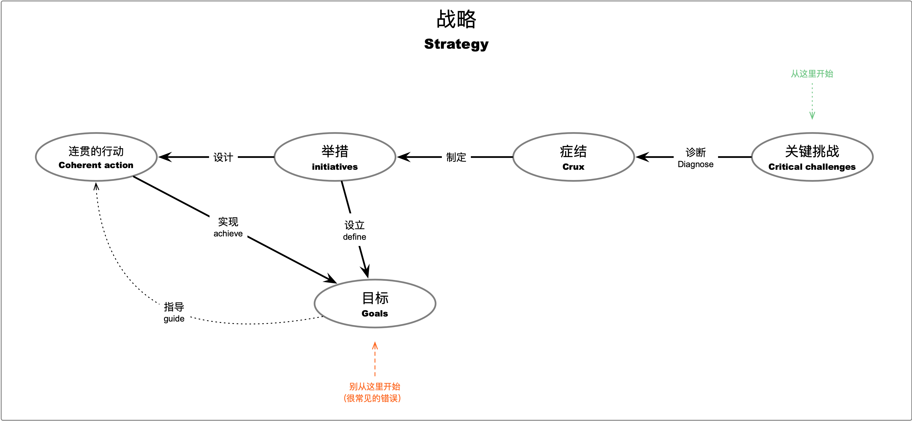

## 第 15 章：不要混淆战略和管理

战略和管理是不同的。
* 战略：始于认识到挑战和困难、明确目的和目标。
* 管理：有效地达成目标，常被称为执行。

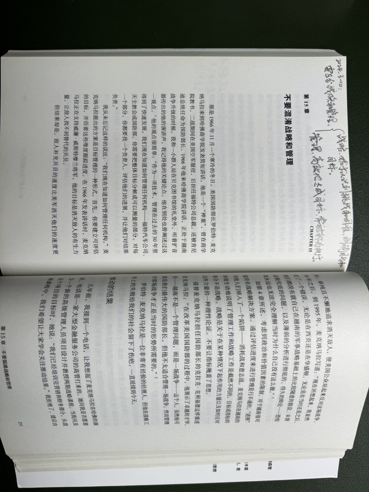

## 第 16 章：不要混淆当前的财务结果和战略

主流的代理理论提出这样一个假设：“经理人（即股东代理人）会懈怠，且会以自身利益为重”。为了让经理人和股东利益一致，则必须对经理人施以激励。现今主流的激励方案是将薪酬与股价挂钩。但这并不合理，原因有：
1. 当前股价并不仅是当前经理人和员工努力工作的结果，也和过去的努力和决策相关。
2. 一时的股价并不代表公司的价值。一家公司的价值取决于未来向股东支付的回报（比如股息、被收购的回报等）。

而且还会导致经理人因为压力做出短期有益、长期有害的决策。更为致命的是，激励只能解决动机问题，解决不了战略无能、信念问题等等问题。

那么，能做些什么呢？
1. 让经理人成为长期股东。
2. 调整公司的投资人。努力吸引相信公司创造长期价值的投资人。让董事会里多一些懂业务的人，少一些只懂财务会计的人。

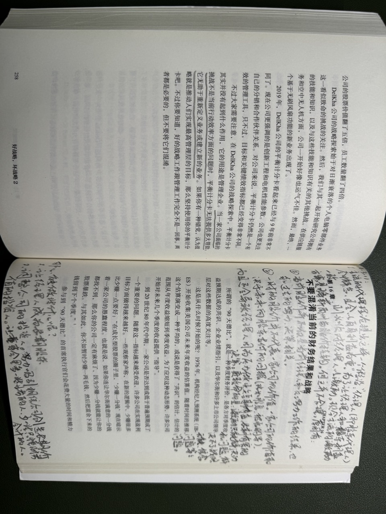

## 第 17 章：战略规划 —— 命中和失误、使用和误用

大多数企业面临的根本问题是所谓的战略规划流程没有产生战略（即解决关键挑战）。只是在试图和控制财务结果，或制定具有任意性的财务目标。

仔细地制定使命、愿景、价值观是一件毫无意义的活动，缺乏逻辑性。且没有证据证明它有效、可持久。它们都无法指导战略的产生。

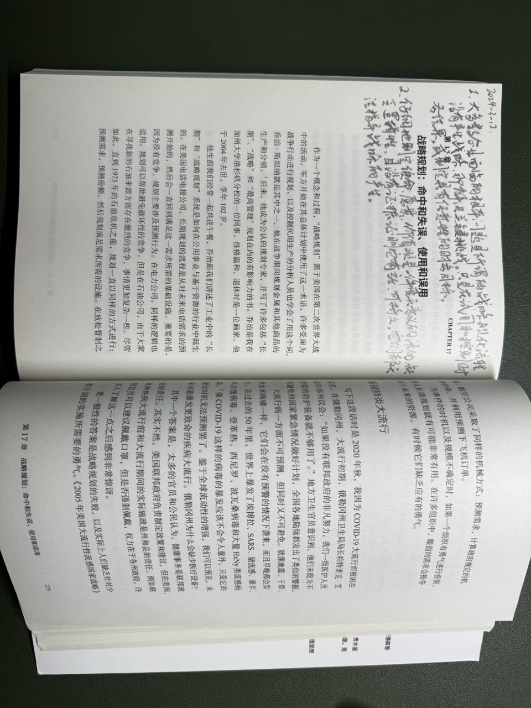

## 第 18 章：拉姆斯菲尔德的问题

对于一个团队如何把信息综合起来创造战略，我们知之甚少，和古代相比并无明显进步。基本的方法仍是把一小群聪明人关在一个屋子里，看看他们会想出什么好办法。

现代各种分析技术得到了长足的发展。但分析本身并不能创造出好的战略。

再次强调：战略不是设定一个期望的结果（尖锐点说，是“一厢情愿的想法”）。这是一个很常见的误解。

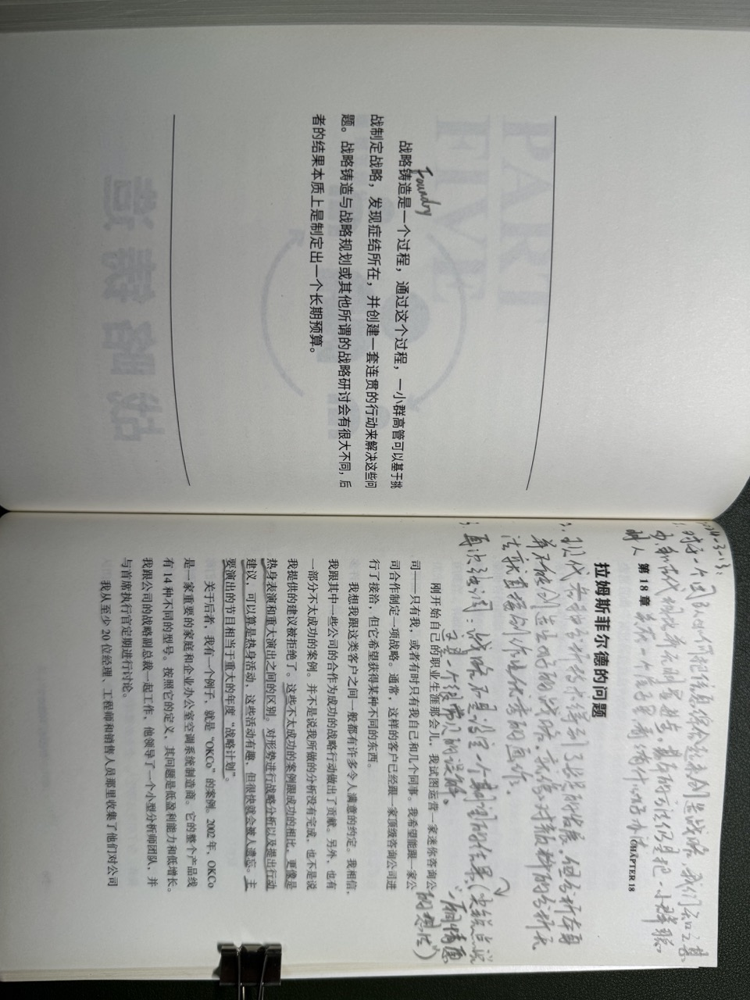

## 第 19 章：战略铸造演练

略

## 第 20 章：战略铸造的概念和相关工具

略

