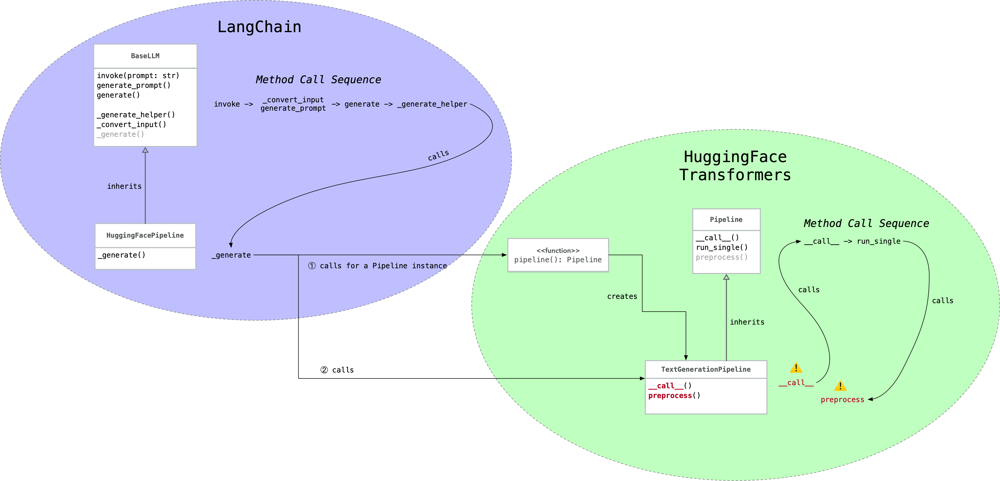

## 简介

最近测试开源大模型的时候，遇到了一个挺隐蔽的 silent error，值得记录一下。

具体现象是这样：
1. 几个 Chat 大模型的表现像是在做基础模型的续写，不像是对话。
2. 但他们在 MaaS 或 HuggingFace Space 上的表现却明显是对话。

其中一个模型是阿里开源的 Qwen/Qwen1.5-14B-Chat。在阿里云的灵积 MaaS 上它的表现很符合预期，就是对话。而我们自己跑起来测试的时候就是续写。

## 项目

我们的项目使用了 LangChain v0.1.16 和 Transformers v4.40.1。代码大致是这样：

```python
from transformers import AutoModelForCausalLM, AutoTokenizer, pipeline

tokenizer = AutoTokenizer.from_pretrained(...)
model = AutoModelForCausalLM.from_pretrained(...)
pipe = pipeline("text-generation", model, tokenizer)

from langchain_core.prompts import ChatPromptTemplate
from langchain_community.llms.huggingface_pipeline import HuggingFacePipeline

prompt = ChatPromptTemplate.from_messages([
    ('system', 'You’re a chatbot'),
    ('user', 'Hey')
])
llm = HuggingFacePipeline(pipeline=pipe)

chain = prompt | llm | ...
```

## 解决

仔细检查代码和下载的模型，我们并没有发现问题。我的同事国杰参考官方 demo 写了一个测试脚本来执行我们的任务，表现符合预期，是对话。

于是就在我们的项目里自定义了一个`CustomPromptTemplate`，替换掉 LangChain 的`ChatPromptTemplate`，大致是：
```python
from langchain_core.prompts import StringPromptTemplate
from transformers import PreTrainedTokenizer, PreTrainedTokenizerFast

class CustomPromptTemplate(StringPromptTemplate):
    tokenizer: PreTrainedTokenizer | PreTrainedTokenizerFast

    def format(self, **kwargs):
        messages = [
            {"role": "system", "content": "You’re a chatbot"},
            {"role": "user", "content": "Hey"}
        ]

        return self.tokenizer.apply_chat_template(
            messages,
            tokenize=False,
            add_generation_prompt=True
        )

tokenizer = AutoTokenizer.from_pretrained(...)
...
prompt = CustomPromptTemplate(tokenizer)
chain = prompt | llm | ...
```

再测试，发现我们的项目里开源大模型的输出也是对话了。

到此，问题已经解决了。我对其中的症结产生了兴趣，也想排查是否会引入其他潜在问题。所以顺着解决方案继续分析。

## 分析

首先来看 LangChain 和 Transformers 搭配使用时的关键调用链路：



关键点是右下角的`__call__`和`preprocess`两个方法，来看看 Transformers 的关键代码（完整代码见 [text_generation.py](https://github.com/huggingface/Transformers/blob/c712d05aa8fc8ba3ebe465079bd377d2dc9c2e07/src/Transformers/pipelines/text_generation.py#L246)）：
```python
class TextGenerationPipeline(Pipeline):
    def __call__(self, text_inputs, **kwargs):
        if isinstance(text_inputs, (list, tuple)) and isinstance(text_inputs[0], (list, tuple, dict)):
            # We have one or more prompts in list-of-dicts format, so this is chat mode
            if isinstance(text_inputs[0], dict):
                return super().__call__(Chat(text_inputs), **kwargs)
            else:
                chats = [Chat(chat) for chat in text_inputs]  # 🐈 🐈 🐈
                return super().__call__(chats, **kwargs)
        else:
            return super().__call__(text_inputs, **kwargs)

    def preprocess(
        self,
        prompt_text,
		...
    ):
        if isinstance(prompt_text, Chat):
            inputs = self.tokenizer.apply_chat_template(
                prompt_text.messages,
				...
            )
        else:
            inputs = self.tokenizer(
                prefix + prompt_text,
                ...
            )
        	...
```
从`__call__`的代码中可以看出，参数`text_inputs`必须符合一些类型要求，才会被 Transformers 当作对话处理，后续执行到`preprocess`方法时才会调用`tokenizer.apply_chat_template`。

什么类型才符合要求呢？Transformers 最常规的用法就符合，比如：
```python
messages = [
    {"role": "system", "content": "You’re a chatbot"},
    {"role": "user", "content": "Hey"}
]
```
它的类型是`list[dict]`。

而 LangChain 提供的 text_inputs 不符合这些要求，就走到了 else 分支，后续在`preprocess`方法里没有调用`tokenizer.apply_chat_template`，被当作非对话处理了。

具体来说是这样，以 LangChain 常见的 prompt template 用法为例：
```
prompt = ChatPromptTemplate.from_messages([
    ('system', 'You’re a chatbot'),
    ('user', 'Hey')
])
```

LangChain 提供给 Transformers 的 text_inputs 是这样的：
```python
[
	"System: \nYou’re a chatbot\n\nHuman:Hey"
]
```
它的类型是`list[str]`。

到这里，分析结束。我们有两种解决方案：
1. 在调用 Transformers 之前对 prompt 调用`tokenizer.apply_chat_template`。这也是前述我同事国杰采用的方法。
2. 提供符合 Transformers 需要的 prompt 格式，比如上面提到的`list[dict]`，由 Transformers 在其内部调用`tokenizer.apply_chat_template`。

如果你对为什么`tokenizer.apply_chat_template`这么关键感到好奇，可以阅读这两篇文章：
1. https://huggingface.co/docs/Transformers/chat_templating
2. https://huggingface.co/blog/chat-templates
