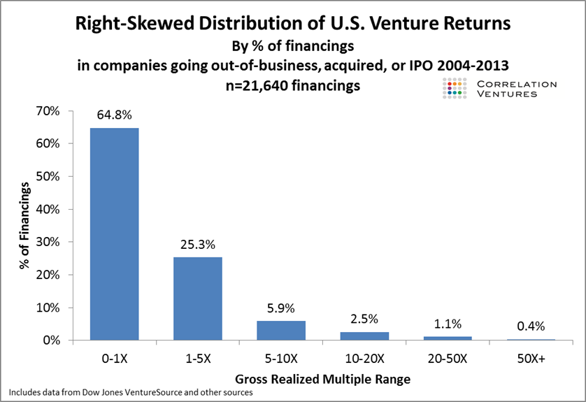
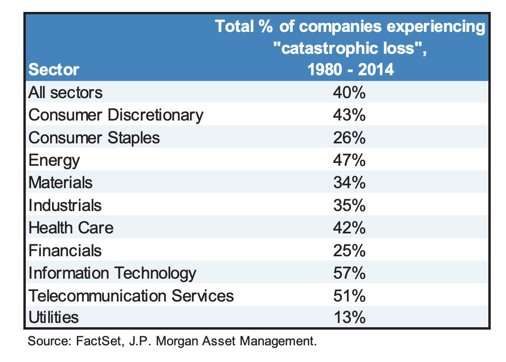
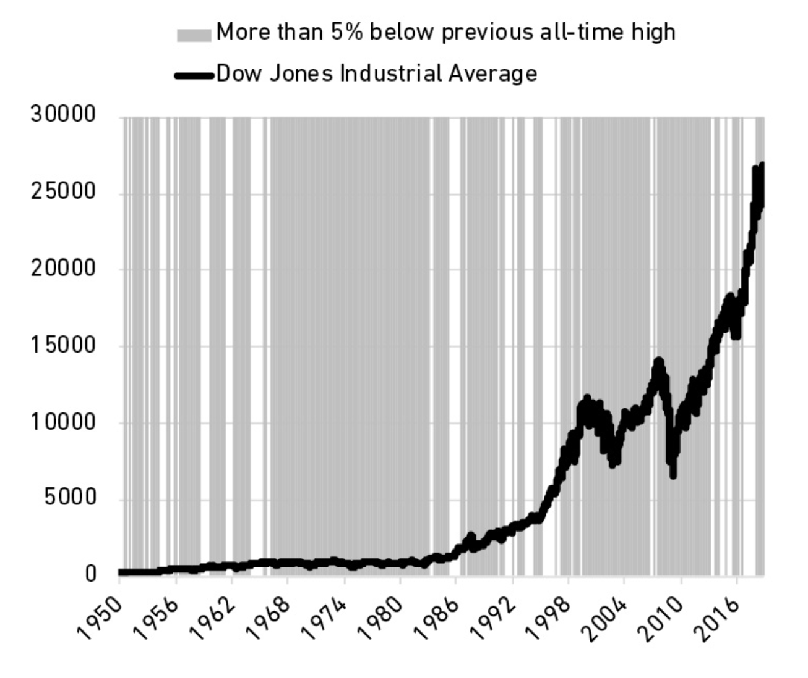



## 一、只需做对很少的事情 + 别掉下牌桌

在投资中，做对少数几件事就足以来丰厚的回报。所以失败了不用灰心，重要的是设置好安全边界，让自己一直能待在牌桌上。换句话说，别做“成则一步登天，败则万劫不复”式的赌博。

来自风险投资领域的统计数据 [^1]：
- 65% 的投资是亏损的。
- 2.5% 的投资能带来 10~20 倍的回报。
- 1% 的投资带来了 20~50 倍的回报。
- 而最顶尖的那 0.4% 带来了 50 倍以上的回报。

这种“大多数失败、极少数成功”的极度不均衡分布情况，并不只出现于风险投资。公开股票市场里也是如此：绝大多数的公司都会遭遇灾难性下跌，且再难爬起来 [^2]。

## 二、买了潜力股、但拿不住

1968 年，我买了一些标普 500 的指数基金，到 2018 年卖掉的时候，它翻了 119 倍。  
2002 年，我买了一些 Netflix 的股票，到 2018 年卖掉的时候，投资回报率是 35,000%（不用数了，350 倍）。

开玩笑的，1968 年我还没有出生，2002 年我也没有炒股、也不知道 Netflix 是啥。所以上面都是“如果”。  
从这些“如果”看上去，投资似乎并不难，买十万块的指数基金，等着他变成一千一百九十万或者三千五百万就好了。

但为什么绝大多数人做不到？因为“拿住”的真实代价，远超后见之明的想象。

这个代价，是这张寻常的曲线图中的时间分布：在绝大多数日子里，股价都比之前的高点跌了至少 5%。这意味着，投资者大部分时间里都在承受“失去利润”的煎熬，而不是收获增长的喜悦。

试想一下：  
一年前我按 ¥30 的单价买了些股票，上月初它冲到了 ¥200，算下来我的收获颇丰。可自那以后它一直徘徊在 ¥150 左右，终于在今天，它开盘反弹到了 ¥190、但收盘时回落到 ¥180。卖不卖？

“卖不卖？”，这是投资者们在绝大多数时间里都在面对的灵魂拷问。

对于买了 Netflix 股票的投资者来说，“绝大多数时间”是指 94% 的日子。也就是说，每个月都有那么 29 天，投资者看着比高点跌了至少 5% 的股价，懊悔或焦虑地问自己“落袋为安还是搏下去？”

因此，“拿不住”不是因为意志不够坚定，而是一种更符合人性的反应。

也因此，作者摩根 · 豪泽尔抛出一个有意思的观点：买我们对之有“感情”的资产，比如这样公司的股票 —— 我认同它的理念，我信赖它的产品，我欣赏它的掌舵人。这些感情会支撑我们熬过低谷期。

看看 Netflix 的长期投资者需要经历些什么 [^3] [^4]：
- 2008 年金融危机，Netflix 股价跌 55.9%
- 2011 年 Netflix 主动分拆传统 DVD 邮寄业务，股价暴跌了 80% 
- 2020 年疫情爆发，Netflix 股价跌了 22.9%
- 2021 年底到 2022 年中，Netflix 股价暴跌 75.9%，从 $691 跌到 $166 。直到 2024 年下半年才重新爬回高点

这些代价，旁观者不容易看得见。

而另一方面，投资者也会主动避免付出看得见的代价，这是“拿不住”的另一个原因：我们常把市场波动视为“罚金（Fine）”，而非“门票（Fee）”。

下一篇：[《The Psychology of Money》读书小记之二：不同的游戏、‘睿智‘的悲观](/posts/2025-12-07-the-psychology-of-money-reading-notes-part-2)

[^1]: www.collaborativefund.com/uploads/venture-returns.png
[^2]: [eotm\_2014\_09\_02\_agonyescstasy.pdf](https://www.chase.com/content/dam/privatebanking/en/mobile/documents/eotm/eotm_2014_09_02_agonyescstasy.pdf)
[^3]: [How Netflix Nearly Lost Its Footing and What it Did to Recover](https://www.teampay.co/blog/netflix-recession#:~:text=Despite%20this%2C%20in%202011%2C%20Netflix,crisis%2C%20were%20counting%20every%20penny.)
[^4]: [Things To Be Wary Of When Buying Netflix Stock | Nasdaq](https://www.nasdaq.com/articles/things-be-wary-when-buying-netflix-stock)
