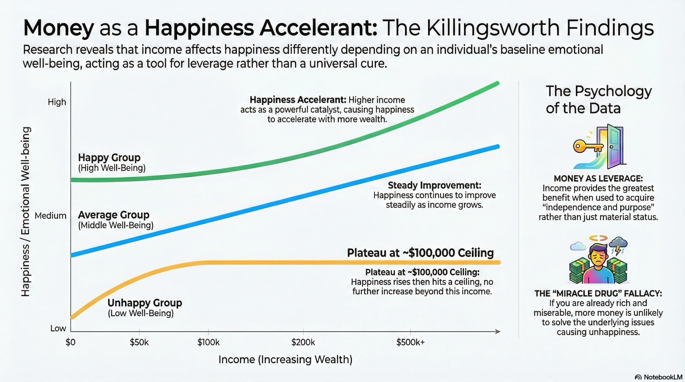



## 主旨与核心

这本书的主旨是“钱是工具，用来帮助我们得到幸福”。由此引发出一个核心话题：“我追求的幸福是什么”。

简单地说，金钱本身不是幸福。这很容易理解，但知行合一却不容易 —— 我们可能会把钱当作幸福的量化指标去追逐；我们也可能会把钱花在昙花一现的东西上，比如他人“哇奥”的感叹或羡慕忌妒。

那么，我追求的幸福是什么？长什么样？

这本书行文自然流畅，读起来愉悦轻松，但这个终极课题却让我屡屡陷入思考。

## 金钱和幸福的关系

笼统地说，钱会帮助人们获得更多幸福。

但它的效用会根据情况有一些分化：
- 对于不怎么幸福的人，起初，钱能带来幸福感。但达到一个程度后，钱就无法带来更多的幸福感。这好理解，钱无法帮人改掉恶习，钱无法给予你理想的原生家庭。
- 对于已经比较幸福的人，钱的边际效用是线性的 —— 多一些钱就多一些幸福。
- 对于那些幸福感原本就很强烈的人，钱的边际效用是递增的，多一些钱能带来更多的幸福，相当于催化剂。

出自：[Does more money correlate with greater happiness?](https://penntoday.upenn.edu/news/does-more-money-correlate-greater-happiness-Penn-Princeton-research)

在努力挣钱的同时，可以想想，我处于哪条曲线、哪一段？

## 自私的写作

作者说他信奉“自私的写作”，也就是写自己感兴趣的话题、把自己当作唯一重要的听众，而不去考虑读者是否感兴趣。

原因有二：
1. 这样让自己更愉悦。
2. “了解受众、面向受众”的写作方式很容易腐化成“无底线地迎合受众”。

花钱也是一样，把钱花在能愉悦自己的东西上，而不是花在让别人艳羡的东西上。

在满足别人的期待上，我们可能是拙劣的演员。但在做自己这件事上，我们是天才。

有这个“为自己花钱”的逻辑，引出了另一个问题：怎样才算独立思考？

## 独立思考

什么是真正的独立思考？

作者有一个有意思的观点：如果通过对你某一个方面的掌握，无法推断出你在其他方面的表现，说明你是独立思考者。

举个反例：如果我知道了你的收入情况，能猜出你开什么车、常穿哪几个牌子的衣服。这可能说明你跟随了大潮、缺少独立思考。

举个正例：如果你在花钱上表现出明显的不一致性，那么你可能是独立的思考者。比如你在某件事上花了很多钱，在另一方面近乎吝啬 —— 这说明你的钱是为你服务的，而不是反过来。

## 坦诚和友善不只是最好的美德，更是最好的策略

坦诚和友善是美德，这不言而喻。

同时，它们也是高明的利己策略 —— 我们常常过高地估计了个人才华对于取得成绩的影响，而低估了外部因素起到的作用，比如他人的帮助。

待人以诚善能让我们留在别人的善意圈里。这样，我们更容易获得帮助，也就更容易成功。

书中一个触动我的小故事 —— 你永远不知道智慧会以什么面貌出现：

> Kevin Costner, one of the greatest and most successful actors of modern times, once told a story that stopped me in my tracks.
>
> Costner had a friend — he doesn’t say who, but when you piece together the details was almost certainly the author Michael Blake — who after years of writing had found little success.
>
> I sent him on a lot of jobs” trying to find him work, Costner said. “Every report that came back was that he pissed everyone off.”  
> The friend pushed Costner to make introductions. “Even though every writer thinks the last thing they wrote is the best thing they wrote, maybe it’s just not good enough,” Costner bluntly told him.
>
> One day the friend called Costner and said, “Hey, I don’t have a place to stay, can I stay at your house?” He was homeless.  
> “So he stays there for a couple of months,” Costner says. The whole time the friend was writing furiously. “He’s writing every night. And he says, ‘Will you read what I wrote today?’ ”  
> “I said no.” It was like Costner thought of the friend as a stray cat to pity, not a work collaborator to admire and learn from.  
> “He started reading it to my daughter, who was three, every night,” Costner said. “Finally my wife said, ‘Look, he’s got to go.’ I said to him, ‘Yeah, you got to go.’ ”  
> Away the friend went. He eventually found himself in Arizona, washing dishes in a Chinese restaurant.
> 
> Months later he called Costner and asked, “Did you ever read what I wrote?”  
> “No,” Costner said.  
> Feeling bad, Costner sent the friend — still ostensibly homeless — a sleeping bag.  
> Later the friend called and asked again: “Did you ever read what I wrote?”  
> Annoyed, Costner relented.  
> “Finally I read it,” Costner said.  
> “It was Dances with Wolves.”  
>
> It went on to be a blockbuster. The film adaptation won seven Academy Awards and catapulted Costner’s career into superstardom.”

下面几个片段写得太好了，无论我怎么理解和转述，都难以企及作者的表达，就原文附上：

> The Luckier You Are, the Nicer You Should Be.

> Kevin Costner’s story is such a good example of never realizing where help in life might come from, and how people who don’t look like the picture of success might actually hold the wisdom you’re looking for.”

> The world is unequal — always has been and always will be. Skill is unequal, so that’s for the better. But the knee-jerk association between wealth and wisdom turns dangerous when you think it’s absolute. We’re fortunate to live in a world that’s so wealthy, with so much opportunity, and so much material abundance. But it’s also become easier than ever to dangerously assume that only those who dress a certain way, live a certain way, or earn a certain income are worth paying attention to.

